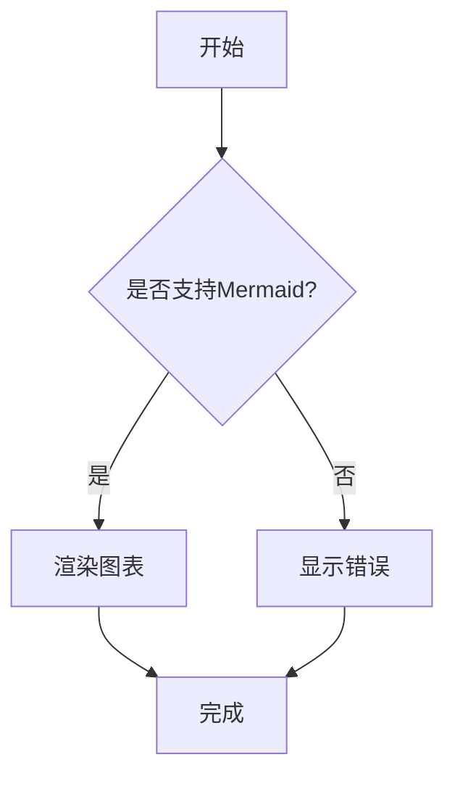
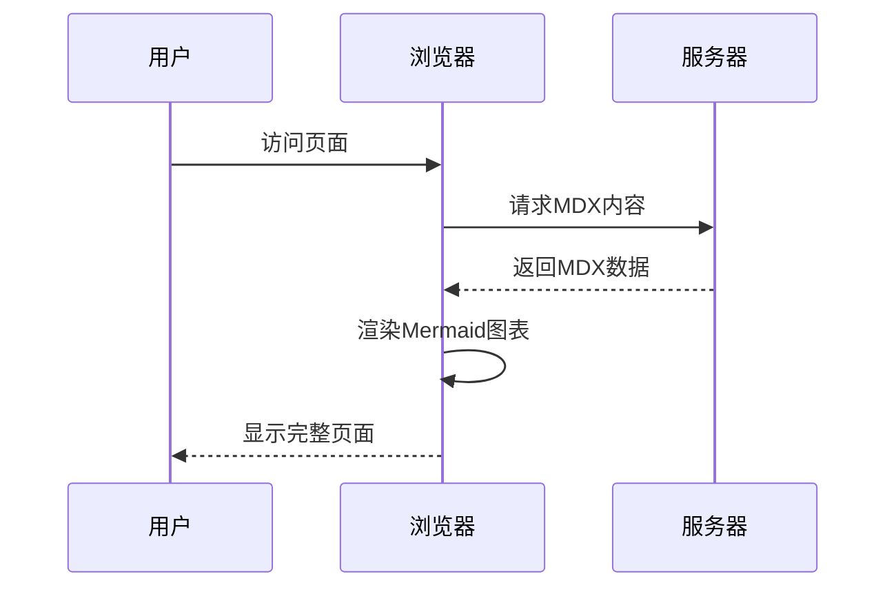
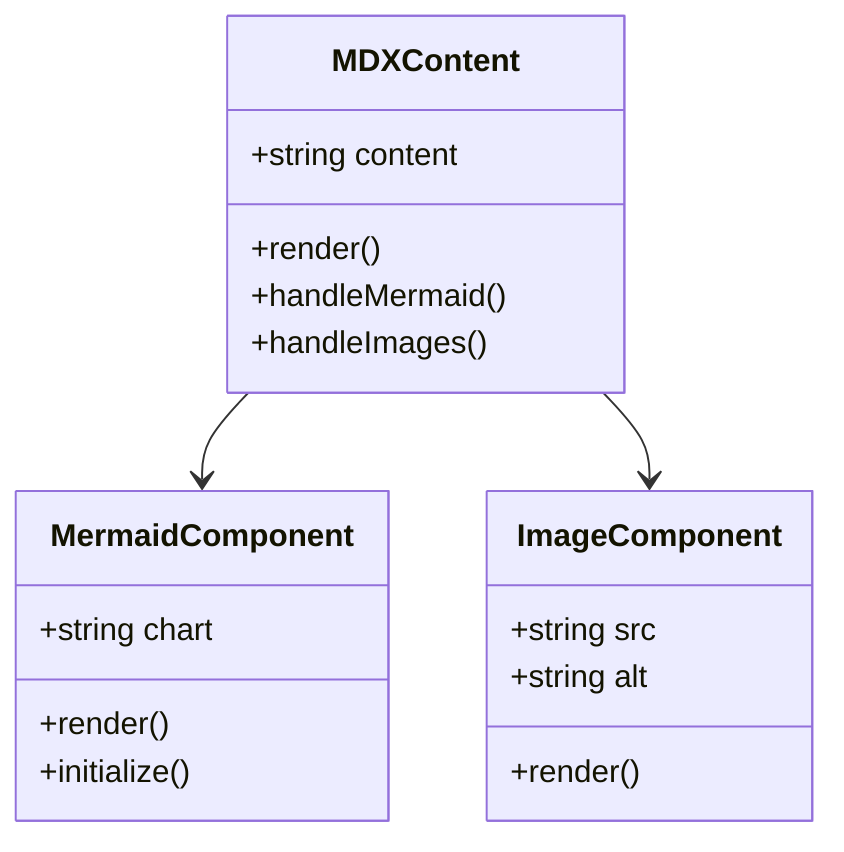
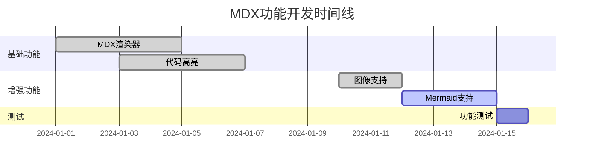
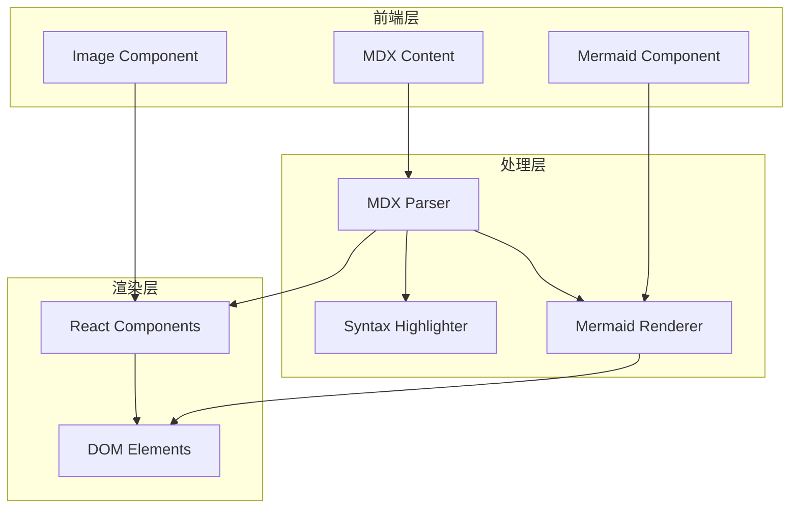
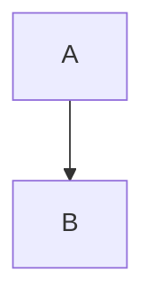

# MDX 功能增强测试

本文档用于测试 MDX 渲染器的新功能：图像显示和 Mermaid 图表支持。

## 图像显示测试

### 外部图像


## Mermaid 图表测试

### 流程图



### 序列图



### 类图



### 甘特图



## 系统架构图



## 测试结果

如果你能看到上面的图像和各种 Mermaid 图表正确渲染，说明 MDX 功能增强成功！

### 功能特点

- ✅ 支持外部图像链接
- ✅ 图像自动优化和懒加载
- ✅ 图像描述文字显示
- ✅ Mermaid 流程图
- ✅ Mermaid 序列图
- ✅ Mermaid 类图
- ✅ Mermaid 甘特图
- ✅ 响应式设计
- ✅ 深色模式兼容

## 代码示例

在 MDX 中使用这些功能非常简单：

````markdown
# 插入图像


# 插入 Mermaid 图表


````

```

这样就可以在你的博客文章中轻松添加丰富的视觉内容了！
```
