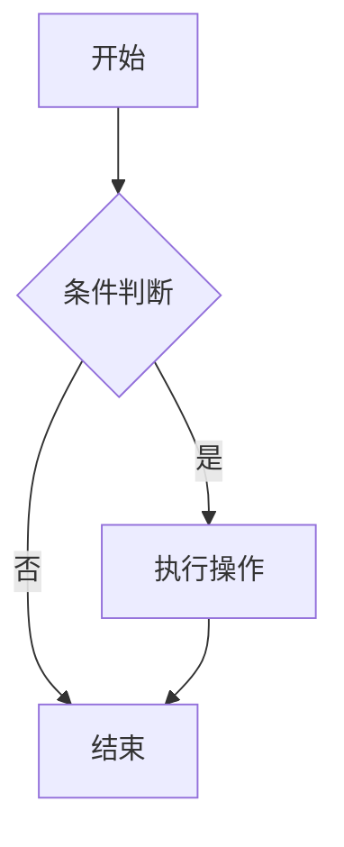
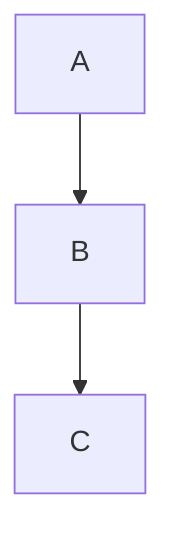
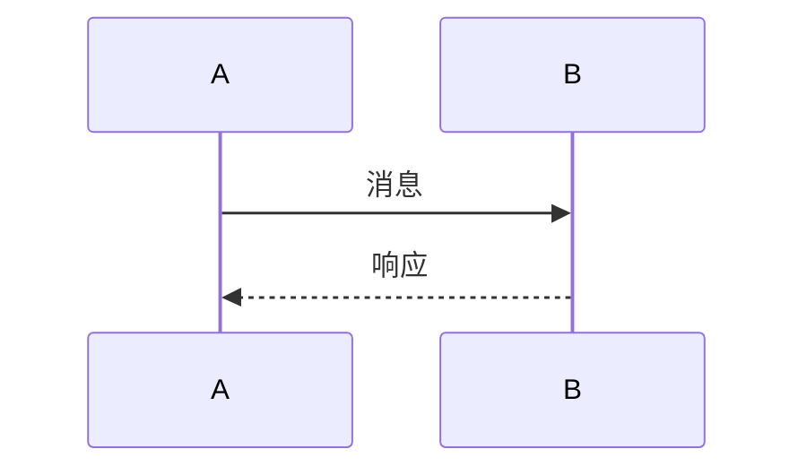
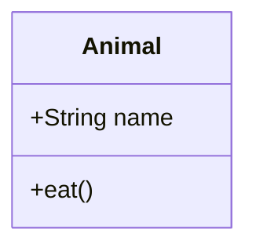
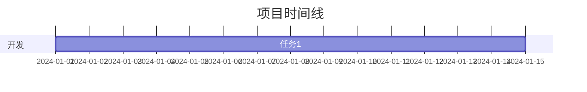

# MDX渲染器功能增强

本文档介绍了为Next.js博客项目添加的MDX渲染器增强功能，包括图像显示和Mermaid图表支持。

## 新增功能

### 1. 图像显示支持

#### 功能特点
- 支持外部图像链接（http/https）
- 支持本地图像（使用Next.js Image组件优化）
- 自动懒加载
- 响应式设计
- 图像描述文字显示
- 深色模式兼容

#### 使用方法
```markdown

```

#### 示例
```markdown


```

### 2. Mermaid图表支持

#### 功能特点
- 支持多种图表类型（流程图、序列图、类图、甘特图等）
- 动态加载，避免SSR问题
- 错误处理和降级显示
- 响应式设计
- 深色模式兼容

#### 使用方法
```markdown

```

#### 支持的图表类型

1. **流程图**
```markdown

```

2. **序列图**
```markdown

```

3. **类图**
```markdown

```

4. **甘特图**
```markdown

```

## 技术实现

### 组件结构

```
components/
├── mdx-content.tsx     # 主要MDX渲染组件
└── ui/
    └── Mermaid.tsx     # Mermaid图表组件
```

### 核心代码

#### MDX组件增强
- 添加了`img`组件处理图像显示
- 添加了Mermaid代码块识别和渲染
- 集成Next.js Image组件优化

#### Mermaid组件
- 使用动态导入避免SSR问题
- 客户端渲染确保兼容性
- 错误处理和降级显示

### 依赖包

新增的依赖包：
```json
{
  "mermaid": "^10.x.x",
  "@types/mermaid": "^10.x.x"
}
```

## 使用示例

查看测试文章 `/blog/mdx-features-test` 了解完整的使用示例，包括：
- 各种类型的图像显示
- 多种Mermaid图表类型
- 实际应用场景演示

## 注意事项

1. **图像优化**：外部图像使用标准img标签，本地图像使用Next.js Image组件
2. **Mermaid渲染**：使用客户端渲染，首次加载可能有轻微延迟
3. **错误处理**：Mermaid渲染失败时会显示原始代码
4. **性能**：Mermaid库采用动态导入，不影响初始包大小

## 兼容性

- ✅ Next.js 15.x
- ✅ React 19.x
- ✅ TypeScript
- ✅ 深色模式
- ✅ 响应式设计
- ✅ 移动端适配

## 未来扩展

可以考虑添加的功能：
- 图像缩放和预览
- 更多图表库支持（Chart.js、D3.js等）
- 图像懒加载优化
- Mermaid主题自定义
- 图表导出功能